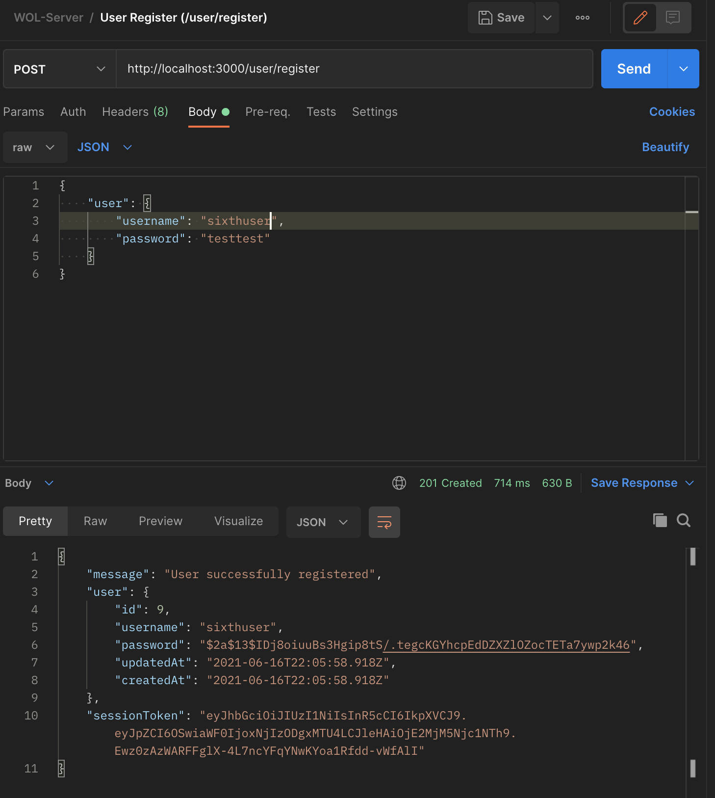
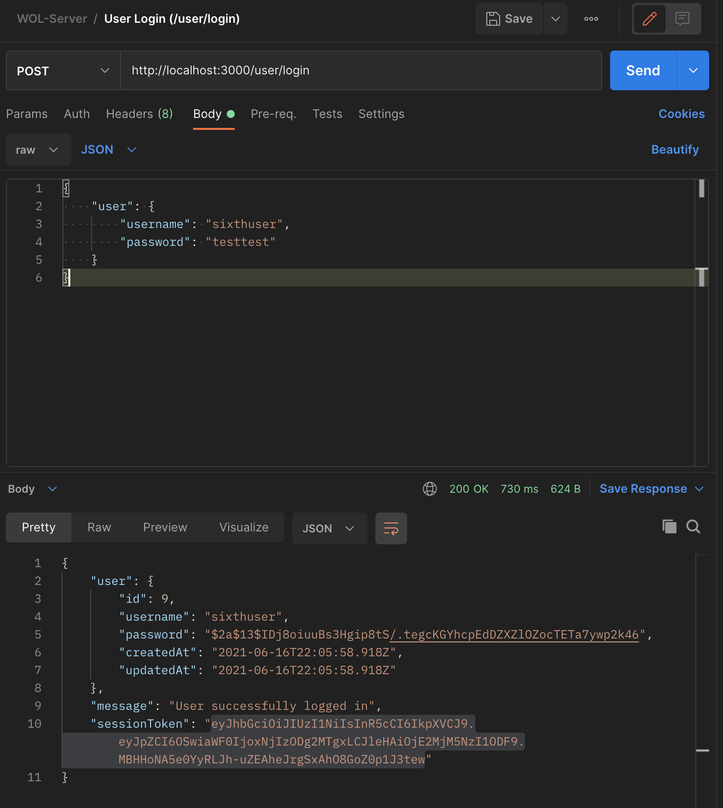
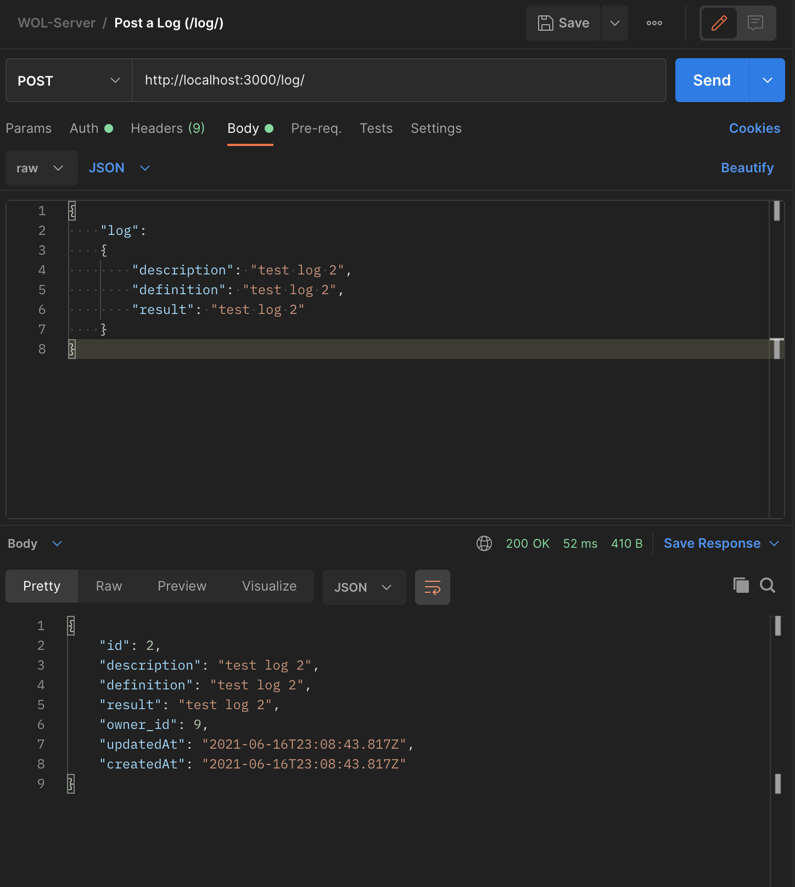
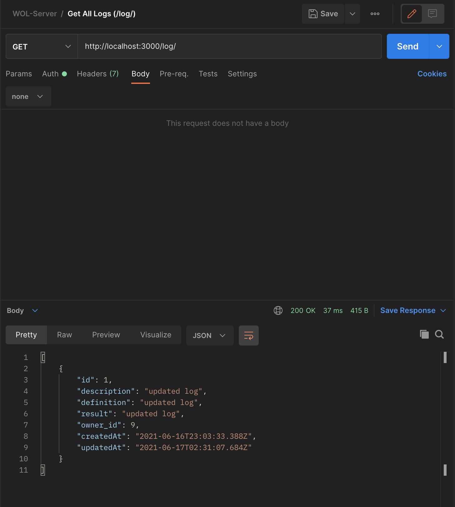
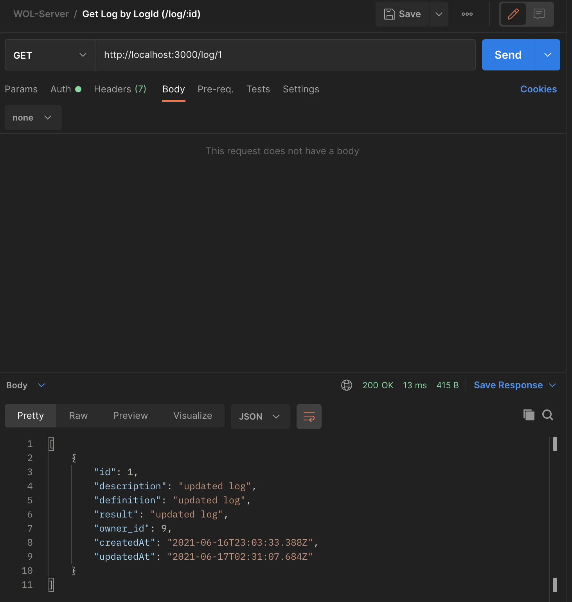
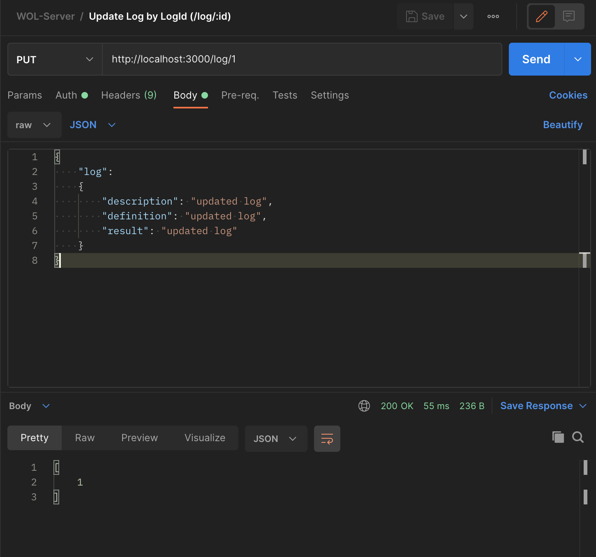
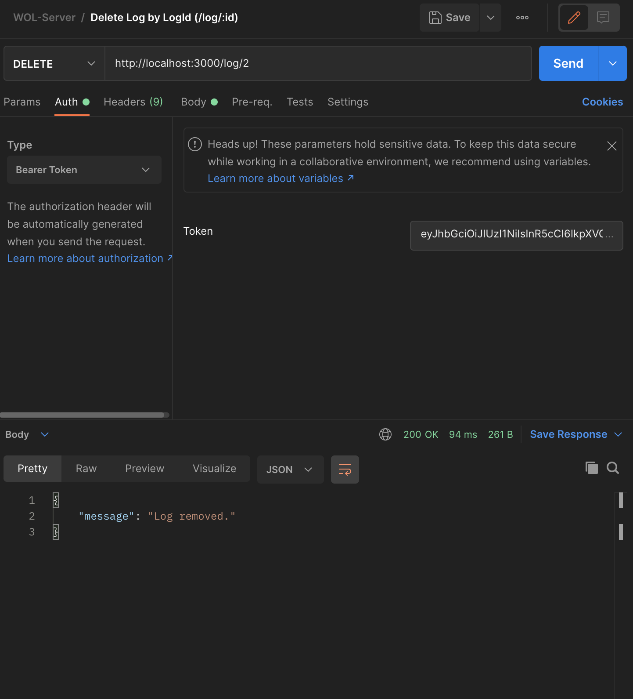

# Workout Log Server
Below are the screenshots of successful postman requests

* /user/register

&nbsp;

* /user/login	

&nbsp;

* /log/ (POST)

&nbsp;

* /log/ (GET)

&nbsp;

* /log/:id (GET) 

&nbsp;

* /log/:id (PUT) 

&nbsp;

* /log/:id (DELETE)  
